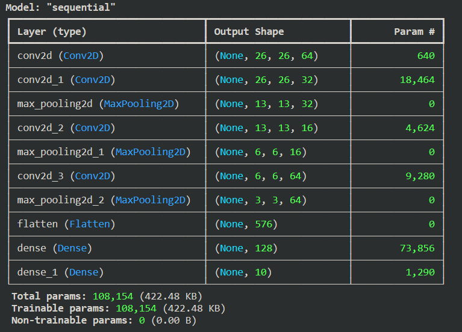
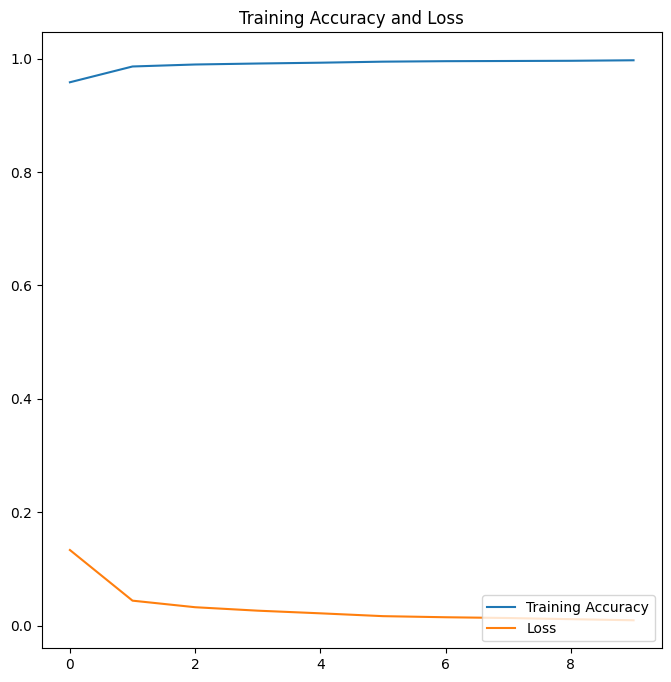
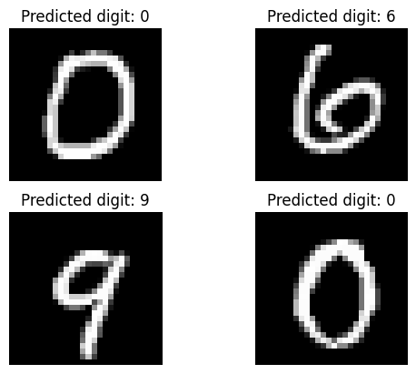
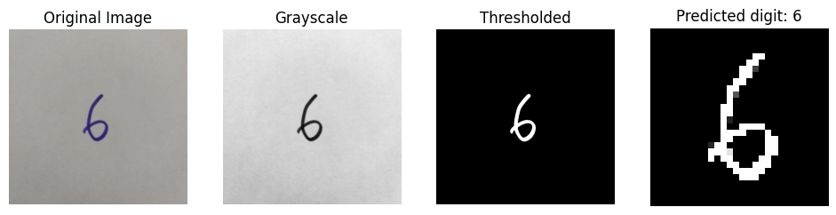

# ✍️ Handwritten Digit Recognition using CNN & OpenCV

A deep learning project that uses a **Convolutional Neural Network (CNN)** to recognize handwritten digits from the MNIST dataset. It also integrates **OpenCV** for real-time digit recognition using a webcam-drawn canvas.

---

## 🚀 Features

- 🔢 Recognizes handwritten digits (0–9) using a trained CNN model  
- 🎥 Real-time digit drawing and recognition via OpenCV GUI  
- 📦 Trained on MNIST dataset (60,000 training images, 10,000 test images)  
- 💾 Saves and loads model using Keras `.h5` format  

---

## 🧰 Tech Stack

- **Language**: Python 3.x  
- **Libraries**: TensorFlow/Keras, OpenCV, NumPy  
- **Dataset**: MNIST  

---

## 📂 Folder Structure

```bash
Handwritten-Digit-Recogonotion-using-CNN-and-OpenCV/
│
├── digit_recognition_cnn.py       # CNN model training and saving
├── recognize_digit_opencv.py      # OpenCV GUI for drawing & recognizing
├── digit_model.h5                 # Pre-trained CNN model (generated after training)
├── assets/                        # Folder for screenshots
│   ├── model-summary.png
│   ├── training-accuracy-loss.png
│   ├── multiple-image-test.png
│   └── custom-image.png
└── README.md                      # Project documentation
```

## 📷 Screenshots

| Model Summary | Training Accuracy and Loss | Multiple Image Test | Custom Image |
|---------------|----------------------------|----------------------|--------------|
|  |  |  |  |

---

## 📸 How It Works

    A CNN is trained on the MNIST dataset to classify 28x28 grayscale images of digits.

    Using OpenCV, users can draw digits in a black canvas window.

    The digit is processed, resized, and passed to the trained model to predict the number.

---

## 🧪 How to Run Locally

*Clone the repository:*
   ```bash
   git clone https://github.com/Rahul-KrishnaA/Handwritten-Digit-Recogonotion-using-CNN-and-OpenCV.git
   cd Handwritten-Digit-Recogonotion-using-CNN-and-OpenCV
   ```

Install dependencies:
   ```bash
   pip install tensorflow opencv-python numpy
   ```

Train the CNN model (optional if you already have digit_model.h5):
   ```bash
   python digit_recognition_cnn.py
   ```

Run the OpenCV digit recognizer:
   ```bash
   python recognize_digit_opencv.py
   ```

## 🙌 Contributing

Pull requests are welcome! For major changes, please open an issue first to discuss what you would like to change.

---
